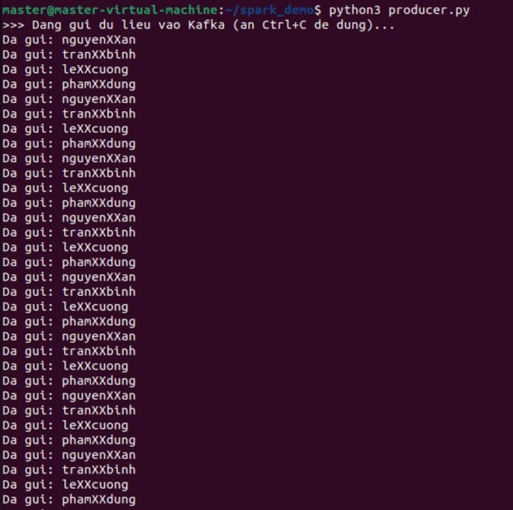
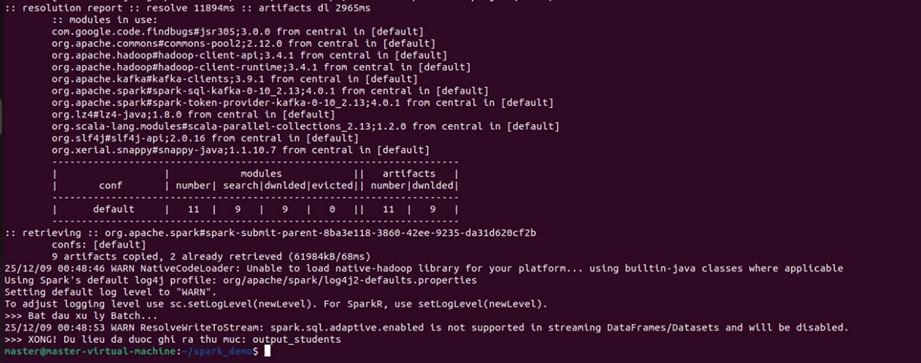
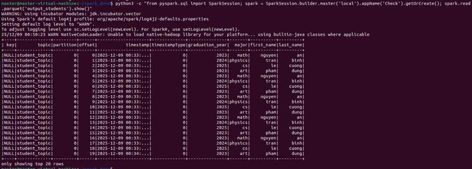

1. cài đặt thư viện pyspark kafka-python bằng lệnh “pip install pyspark kafka-python
2. Ta khởi tạo Kafla bằng Docker qua code và chạy bằng lệnh "docker-compose up -d"
3. File producer.py : Nó tạo ra các gói tin giả lập (thông tin sinh viên: tên, năm tốt nghiệp...) bằng code Python và gửi (push) các gói tin này vào "hộp thư" Kafka (vào Topic tên là student_topic).
   
4. File spark_etl.py: Nó được kết nối với Kafka và lấu dữ liệu từ Kafka. Sau đó xử lý dữ liệu (tên nguyenXXan thành nguyen và an, loại bỏ cột thừa) và cuối cùng ghi dữ liệu sạch xuống ổ cứng dưới dạng file Parquet
   
5. Cuối cùng ta thực hiện kiểm tra nội dung bảng dữ leieuj từ file Parquet trong thư mục ouput_students bằng lệnh “python3 -c "from pyspark.sql import SparkSession; spark = SparkSession.builder.getOrCreate(); spark.read.parquet('./output_data').show()"
   
